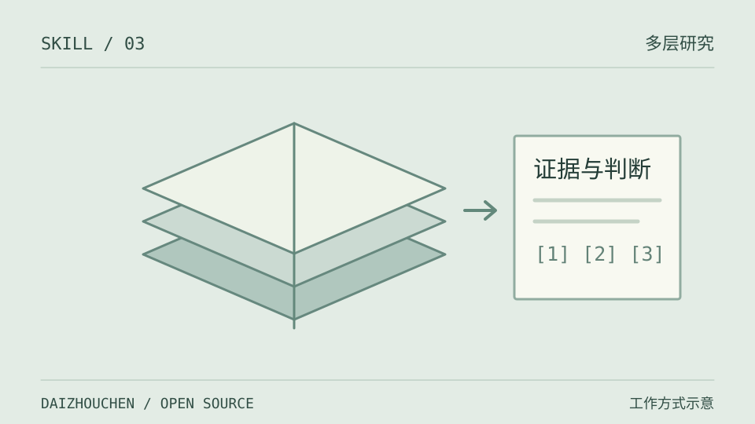

# 棱镜研究 · Prism Research



用纵向发展史和横向比较，研究一个产品、公司、技术、概念或人物。再从事件追到机制、约束和长期变化，输出带来源的 Markdown 与 HTML 报告。

适合明确需要系统深度研究的任务。简单概念解释或单点查询无需启动完整工作流。

## 方法

| 视角 | 研究重点 |
|---|---|
| 纵向 | 起源、关键决策、转折与路径依赖 |
| 横向 | 同类差异、用户选择与竞争格局 |
| 深层分析 | 因果机制、价值链、约束和范式变化 |
| 交汇判断 | 反面证据、情景推演与可观测信号 |

内置完整报告结构，也可按用户的关注点和可用证据缩小范围。篇幅服务研究问题，不为字数补造故事。

## 安装

需要支持本地 Skills 的 AI 助手、Git、Python 3.7+ 和联网搜索能力。HTML 转换仅依赖 `markdown`。

Claude Code 个人安装（macOS / Linux）：

```bash
mkdir -p ~/.claude/skills
git clone https://github.com/daizhouchen/prism-research.git ~/.claude/skills/prism-research
python -m pip install markdown
```

Windows PowerShell：

```powershell
git clone https://github.com/daizhouchen/prism-research.git "$env:USERPROFILE/.claude/skills/prism-research"
python -m pip install markdown
```

保留 `SKILL.md`、`scripts/` 和 `references/`。项目级安装可放在 `.claude/skills/prism-research/`。

## 使用

“用棱镜研究分析 XX，重点比较它与 YY 的技术路线，并标注资料日期和未知项。”

助手会检索和核查来源、构建分析框架，再交付报告。可用子代理时并行分工，否则按同样的研究维度顺序执行。

在仓库目录中转换已有 Markdown：

```bash
python scripts/md_to_html.py report.md report.html --title "研究对象" --author "作者名"
```

HTML 包含封面、目录和打印样式，可在浏览器打印为 PDF。脚本负责排版，不负责联网研究或事实验证。

## 文件与参考

- [SKILL.md](SKILL.md)：研究流程、写作要求、质检清单。
- [references/schema.json](references/schema.json)：分析框架的结构化参考，不是用于自动校验数据的 JSON Schema。
- [scripts/md_to_html.py](scripts/md_to_html.py)：Markdown → HTML。

方法论借鉴索绪尔、Braudel、Porter、Hamilton Helmer、Christensen、Carlota Perez、George Soros 与 Andy Grove 的相关框架。关键事实需在正文附近链接具体来源；查不到的信息标明暂缺，推演与事实分开。

MIT License，见 [LICENSE](LICENSE)。

---
<!-- daizhouchen-footer-begin -->

Part of [**daizhouchen 实验集**](https://github.com/daizhouchen) → 一个 AI 应用创造者的实验现场。
<!-- daizhouchen-footer-end -->
